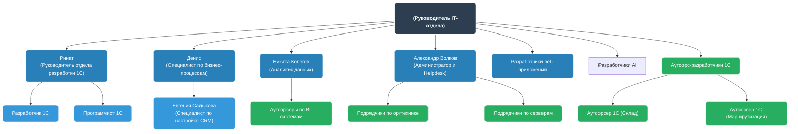

```mermaid
graph TD
                %% --- 1. ОПРЕДЕЛЕНИЕ УЗЛОВ (СОТРУДНИКИ) ---
                %% Просто добавьте новую строку с уникальным ID и текстом для нового сотрудника.
                %% Формат: ID["Имя<br/>(Должность)"]
                %% Например: H["Иван Иванов<br/>(Стажер)"]

                A["<br/>(Руководитель IT-отдела)"]
                
                B["Ринат<br/>(Руководитель отдела разработки 1С)"]
                C["Денис<br/>(Специалист по бизнес-процессам)"]
                D["Никита Колегов<br/>(Аналитик данных)"]
                E["Александр Волков<br/>(Администратор и Helpdesk)"]
                F["Разработчики веб-приложений"]
                 H["Разработчики AI"]
                G["Аутсорс-разработчики 1С"]
                
                B1["Разработчик 1С"]
                B2["Программист 1С"]
                C1["Евгения Садыкова<br/>(Специалист по настройке CRM)"]
                D1["Аутсорсеры по BI-системам"]
                E1["Подрядчики по оргтехнике"]
                E2["Подрядчики по серверам"]
                G1["Аутсорсер 1С (Склад)"]
                G2["Аутсорсер 1С (Маршрутизация)"]


                %% --- 2. ПОСТРОЕНИЕ ИЕРАРХИИ (СВЯЗИ) ---
                %% Добавьте новую связь "руководитель --> подчиненный".
                %% Например, чтобы добавить Ивана Иванова под ваше руководство: A --> H

                A --> B & C & D & E & F & G & H
                B --> B1 & B2
                C --> C1
                D --> D1
                E --> E1 & E2
                G --> G1 & G2


                %% --- 3. СТИЛИЗАЦИЯ БЛОКОВ ---
                %% Этот раздел лучше не трогать. Здесь заданы цвета и скругление.
                classDef boss       fill:#2c3e50,stroke:#fff,stroke-width:2px,color:#fff,font-weight:bold,rx:8px,ry:8px;
                classDef lead       fill:#2980b9,stroke:#fff,stroke-width:1px,color:#fff,rx:8px,ry:8px;
                classDef staff      fill:#3498db,stroke:#fff,color:#fff,rx:8px,ry:8px;
                classDef external   fill:#27ae60,stroke:#fff,color:#fff,rx:8px,ry:8px;

                %% --- 4. НАЗНАЧЕНИЕ СТИЛЕЙ ---
                %% Присвойте класс новому сотруднику по его ID.
                %% Например: class H staff;
                class A boss;
                class B,C,D,E,F lead;
                class B1,B2,C1 staff;
                class G,D1,E1,E2,G1,G2 external;
```